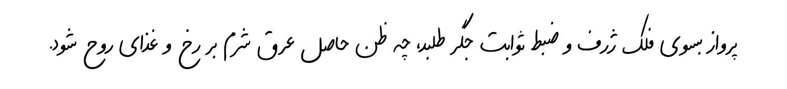

# Farid

A handwritten font primarily aimed at the Persian language.

## Installation

Refer to the [releases](https://github.com/TDCMC/Farid/releases) section for download links.

## Copying

Every part of this project is released under the [SIL Open Font License version 1.1](https://openfontlicense.org/documents/OFL.txt) or [GNU General Public License version 3.0](https://www.gnu.org/licenses/gpl-3.0.txt) unless explicitly stated otherwise.